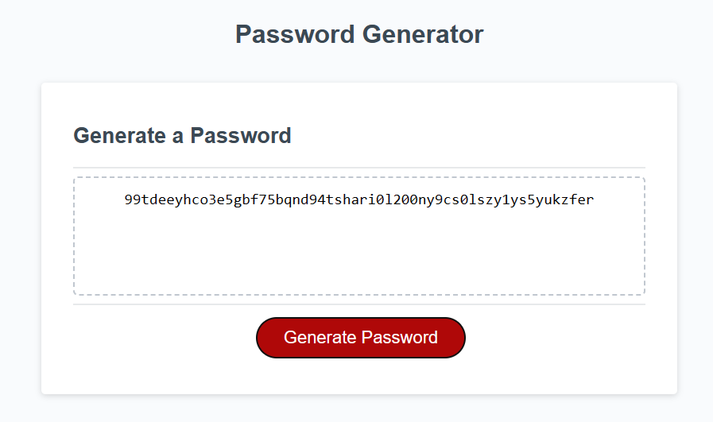

# Password-Generator

## Description

I have created a password generator using Javascript that allows the user to specify how many characters and the type of characters they would like to include in their password.

## Technologies

JavaScript
HTML
CSS

## Installation

No steps are required for installation.

## Usage

https://theoburton.github.io/Password-Generator/

Upon opening the site, you will receive a prompt asking how many characters you would like your pasword to be.

Once you have specified the number of characters the browser will then ask you to confirm/deny which character types you would like your password to contain.

The character types are as follows:

* Lowercase
* Uppercase
* Numbers
* Speacial characters

## License

PLease refer to the License agreement in the repository root.
